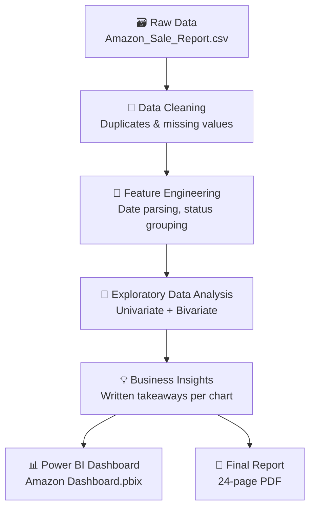

<div align="center">

# 📦 Amazon Sales Data Analysis

### End-to-End Business Intelligence Project — From Raw Transactions to Revenue Strategy

Cleaning, exploring, and visualizing **151,682 Amazon orders** to uncover what sells, where it sells, and why orders get cancelled — turning a raw sales export into a Power BI dashboard and a 24-page analytics report.

[](https://www.python.org/)
[](https://pandas.pydata.org/)
[](https://numpy.org/)
[](https://matplotlib.org/)
[](https://seaborn.pydata.org/)
[](https://jupyter.org/)
[](https://powerbi.microsoft.com/)

</div>

---

## 📌 Overview

An Amazon seller's raw order export is just rows and columns — until someone asks *"why are Merchant-fulfilled orders getting cancelled more often?"* or *"which state should we run our next promotion in?"*

This project takes a **151,682-row Amazon sales export** and turns it into answers. It covers the full analytics lifecycle: cleaning a messy real-world dataset, exploring it statistically, visualizing it in Python, and packaging the findings into an interactive **Power BI dashboard** and a formal **PDF analytics report**.

**Business problem:** Amazon sellers generate huge volumes of order data but rarely have time to interpret it. This project simulates that analyst role — answering concrete questions about revenue trends, fulfilment performance, product mix, and regional demand, then translating each answer into a recommendation.

| | |
|---|---|
| 🗂️ **Dataset** | Amazon Sale Report — 151,682 orders across 22 fields (status, fulfilment, category, size, quantity, amount, ship-to location, B2B flag) |
| 🎯 **Objective** | Identify sales trends, top-performing products and regions, and fulfilment inefficiencies, then recommend actions |
| 🧭 **Workflow** | Data cleaning → EDA → statistical breakdowns → Power BI dashboard → written report |
| 📄 **Deliverables** | Cleaned dataset, annotated Jupyter notebook (178 cells), Power BI dashboard (`.pbix`), 24-page PDF report |

---

## ✨ Project Highlights

<table>
<tr>
<td width="50%" valign="top">

**🧹 Data Cleaning**
Deduplication and missing-value handling on a real, messy Amazon export; standardized order statuses into `Shipped` / `Cancelled` / `Pending` groups for consistent analysis.

**📊 Exploratory Data Analysis**
Univariate and bivariate analysis across category, fulfilment method, shipping service level, geography, and time — 35+ charts generated in the notebook.

**🧮 Feature Engineering**
Parsed order dates into year/month/weekday fields and merged them back into the cleaned table to enable time-based trend analysis.

</td>
<td width="50%" valign="top">

**💡 Business Insights**
Every chart is paired with a written takeaway — not just "what happened" but "what to do about it" (e.g. where to focus marketing, which fulfilment method to favor).

**📈 Interactive Dashboard**
A Power BI dashboard (`Amazon Dashboard.pbix`) consolidating revenue, orders, and cancellation metrics into a single explorable view.

**📝 Professional Report**
A 24-page PDF report ("Amazon Sales Data Analysis — End-to-End Business Intelligence & Analytics Report") documenting the full methodology and findings.

</td>
</tr>
</table>

---

## 📈 Key Metrics at a Glance

| Metric | Value |
|---|---|
| 💰 Total Revenue | **₹92.17M** |
| 🧾 Total Orders | **151,682** |
| 🛍️ Average Order Value | **₹645.58** |
| ❌ Cancelled Orders | **21,501** (14.18%) |
| 📦 Units Sold | **137,342** |
| 🏆 Top Category by Revenue | **T-shirts — ₹45.64M** |
| 🥇 Top State by Revenue | **Maharashtra — ₹15.72M** |

---

## 🔍 Exploratory Data Analysis — Selected Visuals

<details>
<summary><b>📉 Monthly Revenue Trend</b></summary>
<br>


April generated the highest revenue (₹33.85M), followed by May (₹30.86M) and June (₹27.34M), with a gradual decline in both orders and revenue across the quarter.
</details>

<details>
<summary><b>🗺️ Top 10 States by Revenue</b></summary>
<br>


Maharashtra and Karnataka lead by a wide margin, together with Telangana, Tamil Nadu, and Uttar Pradesh accounting for the bulk of total revenue.
</details>

<details>
<summary><b>👕 Revenue by Product Category</b></summary>
<br>


T-shirts are the single largest revenue driver, ahead of Shirts and Blazers — apparel categories dominate the product mix almost entirely.
</details>

<details>
<summary><b>🚚 Cancellation Rate by Fulfilment Method</b></summary>
<br>


Merchant-fulfilled orders cancel at 17.29% vs. 12.77% for Amazon-fulfilled orders — a measurable gap in order completion reliability.
</details>

<details>
<summary><b>📆 Orders by Weekday</b></summary>
<br>


Sunday is the strongest day for both orders and revenue; Thursday is consistently the weakest.
</details>

<details>
<summary><b>🥧 Order Status Breakdown</b></summary>
<br>


A high-level split of Shipped, Cancelled, and Pending orders across the full dataset.
</details>

> These charts are generated directly inside `Amazon_sales_report.ipynb`. Copies are included in `images/` for this README — the notebook itself contains 35 visualizations in total, covering every analysis question below.

---

## 📊 Power BI Dashboard

The `Amazon Dashboard.pbix` file consolidates the notebook's findings into a single interactive view, tracking:

| KPI | What it shows |
|---|---|
| **Revenue** | Total sales value across the dataset, filterable by category, state, and month |
| **Orders** | Order volume trends over time and by fulfilment channel |
| **Average Order Value** | Spend per transaction, segmented by B2B vs. B2C |
| **Cancelled Orders** | Cancellation volume and rate, broken down by fulfilment method and category |
| **Units Sold** | Quantity sold by product category |

Open it locally with **Power BI Desktop** to explore the filters interactively — see [Installation](#-installation--usage) below.

---

## 🧠 Key Business Insights

| Insight | Business Impact |
|---|---|
| T-shirts generate ₹45.64M in revenue — the single largest category, with the highest average order value (₹834.82) | Prioritize inventory, ad spend, and promotions on T-shirts as the flagship product line |
| Merchant-fulfilled orders cancel at 17.29% vs. 12.77% for Amazon-fulfilled orders | Shift more volume to Amazon Fulfilment, or investigate Merchant-side fulfilment bottlenecks |
| Amazon-fulfilled orders ship almost entirely via Expedited (98.96%), while Merchant orders rely solely on Standard service | Standard shipping correlates with lower completion rates — a case for offering expedited options on Merchant orders |
| Maharashtra and Karnataka alone contribute over ₹27M in combined revenue | Concentrate regional marketing and warehousing investment in these two states |
| April was the strongest month for both orders (57,606) and revenue (₹33.85M), with a gradual decline into June | Investigate the April demand driver (seasonality/promotion) and replicate it in future campaigns |
| Sunday is the highest-revenue, highest-order weekday; Thursday is the weakest | Schedule promotions and product launches around weekends for maximum reach |
| B2B orders are under 1% of volume but carry a higher average order value (₹694.05 vs. ₹645.23 for B2C) | A dedicated, low-effort B2B acquisition push could disproportionately lift average order value |
| The apparel core (Shirts, T-shirts, Blazers, Trousers) shows consistent 13–15% cancellation rates across categories | Cancellation is a systemic fulfilment issue, not a single-category defect — fix at the process level |

---

## 🗂️ Repository Structure

```text
amazon-sales-data-analysis/
│
├── Amazon_Sale_Report.csv                     # Raw Amazon sales export (source data)
├── amazon_sales_cleaned.csv                   # Cleaned & feature-engineered dataset
├── Amazon_sales_report.ipynb                  # Full analysis notebook (cleaning → EDA → insights)
├── Amazon Dashboard.pbix                      # Interactive Power BI dashboard
├── Amazon_Sales_Data_Analysis_Report.pdf      # 24-page written analytics report
├── notes.txt                                  # Problem statement, dataset schema, workflow notes
├── images/                                    # Exported chart visuals used in this README
└── README.md
```

---

## 🛠️ Tech Stack


---

## 🔄 Project Workflow



---

## ⚙️ Installation & Usage

**1. Clone the repository**
```bash
git clone https://github.com/JayanthikaKrishnamoorthy/amazon-sales-data-analysis.git
cd amazon-sales-data-analysis
```

**2. Install dependencies**
```bash
pip install pandas numpy matplotlib seaborn jupyter
```

**3. Run the analysis notebook**
```bash
jupyter notebook Amazon_sales_report.ipynb
```

**4. Explore the dashboard**
Open `Amazon Dashboard.pbix` in [Power BI Desktop](https://powerbi.microsoft.com/desktop/) to interact with the filters and drill into any metric.

**5. Read the full report**
Open `Amazon_Sales_Data_Analysis_Report.pdf` for the complete written methodology and findings.

---

## 💼 Business Value

This project mirrors the actual workflow of a retail/e-commerce data analyst: a stakeholder hands over a raw export and expects clear, decision-ready answers back.

- **For operations teams** — the fulfilment and cancellation-rate breakdowns point directly at where order completion is failing.
- **For marketing teams** — the state, category, and weekday insights identify where and when to concentrate spend.
- **For leadership** — the revenue and category summaries answer the top-line "what's actually driving the business" question, backed by a reusable dashboard rather than a one-off analysis.

---

## 🎓 Learning Outcomes

This project demonstrates practical, end-to-end proficiency in:

- Data cleaning and preprocessing on a real, imperfect dataset
- Feature engineering (date/time decomposition, status normalization)
- Exploratory data analysis using Pandas, NumPy, Matplotlib, and Seaborn
- Translating statistical findings into written business insights
- Dashboard design and KPI selection in Power BI
- Structured technical report writing

---

## 👩‍💻 Author

**Jayanthika Krishnamoorthy**

[](https://github.com/JayanthikaKrishnamoorthy)
[](https://linkedin.com/in/jayanthika-k)
